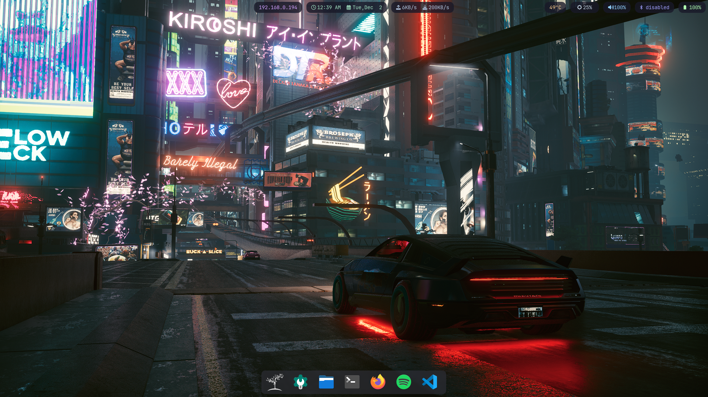
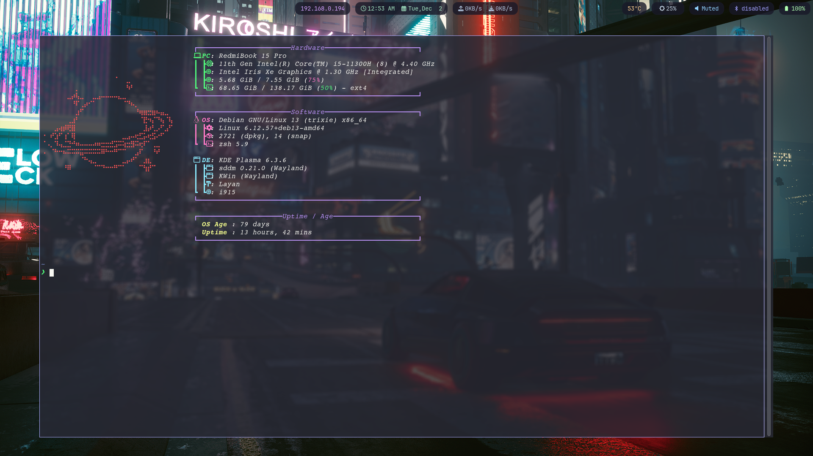
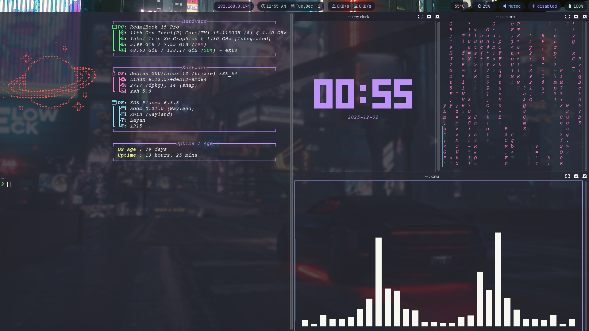

# KDE Plasma Customization (Debian)

## 🌃 CYBERPUNK themed ricing

This repository contains my personal KDE Plasma desktop setup on Debian Linux.  
It includes configuration snippets and assets(dotfiles) for:

- Terminal with **fastfetch**
- A custom **Waybar** panel
- A minimal **wallpaper** setup that fits the theme

> ⚠️ Note: Paths and package names may need to be adjusted for your system.

---

## Screenshots
### Desktop overview



### Fastfetch in terminal



### Terminal



## Repository Structure

```text
KDE-plasma-customization/
├─ fastfetch/   # Fastfetch configuration (system info in the terminal and ascii image)
├─ waybar/      # Waybar configuration (bar / panel styling)
└─ wallpaper/   # Wallpaper(s) used in screenshots / desktop
```

## Requirements

This setup assumes:

 - Debian Linux (or a Debian-based distro)
 - KDE Plasma desktop environment
 - Wayland compositor (if you are using Waybar in a Wayland session)
 - Packages:
    - fastfetch
    - waybar
    - KDE Plasma (and usual utilities)

Install fastfetch and waybar (Debian / apt-based):

```bash
sudo apt update
sudo apt install fastfetch waybar
```

## How to Use This Repo

1. Clone the repository

``` bash
git clone https://github.com/jaaasl/KDE-plasma-customization.git
cd KDE-plasma-customization
```

## fastfetch

Configuration for fastfetch, a fast system information tool similar to neofetch.

Typical usage after installing fastfetch:

``` bash
fastfetch
```

You can copy my config files from this folder into your local fastfetch config directory, usually:

```bash
mkdir -p ~/.config/fastfetch
cp fastfetch/* ~/.config/fastfetch/
```

Adjust paths in the config if necessary (icons, logos, etc.).

## waybar

Configuration for Waybar, a highly customizable bar for Wayland compositors such as Hyprland, Sway, etc.

To use my setup:

```bash
mkdir -p ~/.config/waybar
cp waybar/* ~/.config/waybar/
```


Then (re)start Waybar, for example:

```bash
waybar &
```


or log out and log back in to your Wayland session so the compositor autostart picks it up.


## wallpaper

Contains the wallpaper used with this setup.

To use:

 1. Copy the image(s) to a convenient location (e.g. ~/Pictures/wallpapers).
 2. In KDE Plasma:
     - Right-click on desktop → Configure Desktop and Wallpaper…
     - Select Image and browse to the wallpaper from this repo.


# Customization Tips

 - Treat these configs as a starting point:
    - Edit colors, fonts, spacing in style.css for Waybar.
    - Update modules and commands in config for Waybar.
    - Adjust fastfetch logo, colors, and displayed fields in its config.
 - Keep a backup of your own configs before overwriting them.
 - Use Git to version-control your own tweaks.

# License

This is a personal configuration repo.
If you publish a fork or heavily based setup, a small credit link back to this repo is appreciated.
